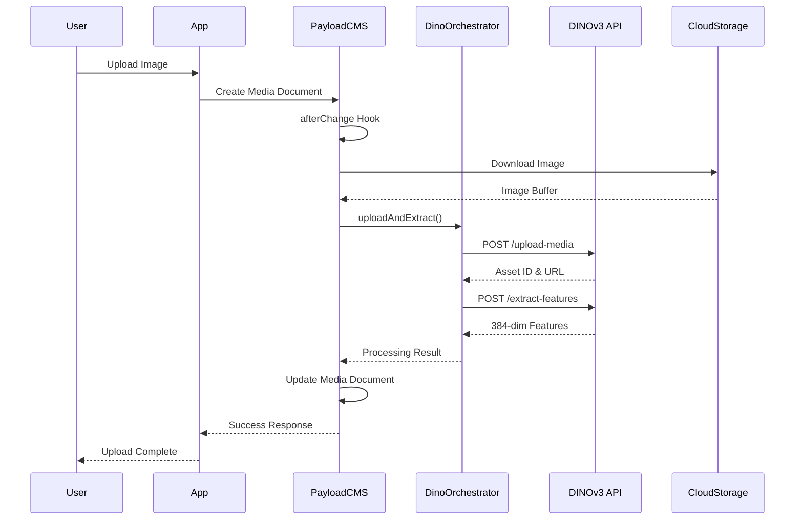
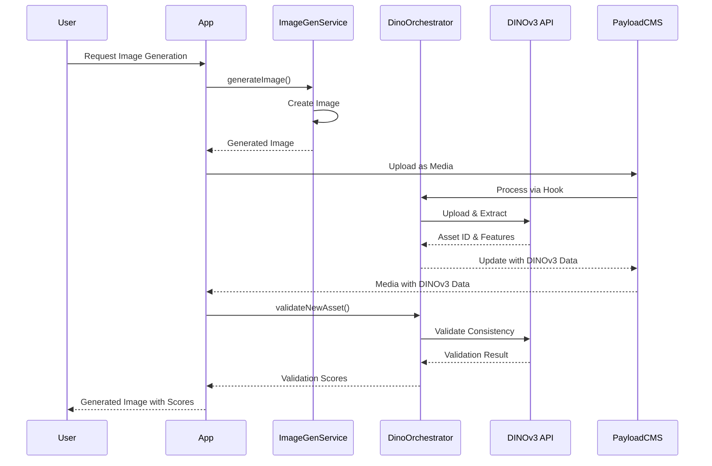

# How to Use DinoV3: A Comprehensive Integration Guide

## Table of Contents
1. [Overview](#overview)
2. [What is DinoV3?](#what-is-dinov3)
3. [Why Use DinoV3?](#why-use-dinov3)
4. [Architecture](#architecture)
5. [Integration Components](#integration-components)
6. [Setup and Configuration](#setup-and-configuration)
7. [Implementation Details](#implementation-details)
8. [API Endpoints](#api-endpoints)
9. [Data Flow](#data-flow)
10. [Best Practices](#best-practices)
11. [Troubleshooting](#troubleshooting)
12. [Implementation in Other Apps](#implementation-in-other-apps)
13. [Examples and Use Cases](#examples-and-use-cases)

## Overview

This document provides a comprehensive guide to integrating DinoV3, a powerful image analysis and validation service, into your applications. It covers the what, where, why, and how of DinoV3 integration, with specific examples from the Character Library application.

## What is DinoV3?

DinoV3 is an advanced image analysis service that provides:
- **Feature Extraction**: Converts images into 384-dimensional feature vectors
- **Quality Analysis**: Scores images based on visual quality (0-100 scale)
- **Consistency Validation**: Determines if two images represent the same character/entity
- **Similarity Scoring**: Provides numerical similarity scores between images

The service exposes a REST API with endpoints for:
- Image upload and feature extraction
- Quality analysis
- Consistency validation between images

## Why Use DinoV3?

### Key Benefits:
1. **Character Consistency**: Ensures generated images maintain character consistency across different scenes
2. **Quality Control**: Automatically filters out low-quality generated images
3. **Automated Validation**: Reduces manual review requirements through automated quality and consistency checks
4. **Feature-Based Search**: Enables semantic image search using extracted feature vectors
5. **Integration Flexibility**: Works with any image generation pipeline

### Use Cases:
- **Character Management**: Validate that all images of a character maintain consistent features
- **Generated Content QA**: Automatically quality-check AI-generated images
- **Image Search**: Find similar images based on visual features rather than metadata
- **Content Validation**: Ensure user-uploaded images meet quality standards

## Architecture

```
┌─────────────────┐    ┌──────────────────┐    ┌─────────────────┐
│   Your App      │────│  DinoOrchestrator │────│   DINOv3 API    │
│   (PayloadCMS)  │    │   Service        │    │   (External)    │
└─────────────────┘    └──────────────────┘    └─────────────────┘
         │                       │                        │
         │                       │                        │
    ┌────▼────┐            ┌────▼────┐              ┌────▼────┐
    │ Media   │            │ Feature │              │ Image   │
    │ Hooks   │            │ Storage │              │ Analysis│
    └─────────┘            └─────────┘              └─────────┘
                                                   │
                                              ┌────▼────┐
                                              │ Cloud   │
                                              │ Storage │
                                              │ (R2/S3) │
                                              └─────────┘
```

### Key Components:
1. **DINOv3 API**: External service for image analysis
2. **DinoOrchestrator**: Internal service managing all DINOv3 interactions
3. **Media Hooks**: Automatic processing of uploaded images
4. **Feature Storage**: Persistent storage of extracted features
5. **Cloud Storage**: Image storage integration (Cloudflare R2 in this case)

## Integration Components

### 1. DinoOrchestrator Service (`src/services/DinoOrchestrator.ts`)

The central service managing all DINOv3 interactions:

```typescript
export class DinoOrchestrator {
  private baseUrl: string
  private apiKey: string
  private qualityThreshold: number = 70
  private consistencyThreshold: number = 85

  constructor() {
    this.baseUrl = process.env.DINO_SERVICE_URL || 'https://dino.ft.tc'
    this.apiKey = process.env.DINO_API_KEY || ''
  }

  // Main methods:
  async uploadAndExtract(imageBuffer: Buffer, filename: string): Promise<{
    dinoAssetId: string
    dinoMediaUrl?: string
    features?: number[]
    status: string
    error?: string
  }>

  async validateNewAsset(
    newAssetId: string, 
    masterRefAssetId: string
  ): Promise<DinoValidationResult>
}
```

#### Key Interfaces:
```typescript
export interface DinoUploadResponse {
  asset_id: string
  media_url: string
  metadata: {
    filename: string
    size: number
    content_type: string
    upload_timestamp: string
  }
}

export interface DinoFeaturesResponse {
  asset_id: string
  features: number[] // 384-dimensional vector
  processing_status: string
}

export interface DinoQualityResponse {
  asset_id: string
  quality_score: number
  diversity_score: number
  feature_stats: {
    mean: number
    std: number
    max: number
    min: number
  }
}

export interface DinoConsistencyResponse {
  reference_asset_id: string
  test_asset_id: string
  same_character: boolean
  similarity_score: number
  confidence: number
  explanation: string
}
```

### 2. Media Collection Integration (`src/collections/Media.ts`)

The Media collection includes DINOv3-specific fields and automatic processing:

```typescript
{
  name: 'dinoAssetId',
  type: 'text',
  label: 'DINOv3 Asset ID',
  admin: {
    readOnly: true,
    description: 'The unique asset ID from the DINOv3 service (R2 object key).',
    position: 'sidebar',
  },
},
{
  name: 'dinoMediaUrl',
  type: 'text',
  label: 'DINOv3 Media URL',
  admin: {
    readOnly: true,
    description: 'The public URL for the media asset from DINOv3 service.',
    position: 'sidebar',
  },
},
{
  name: 'dinoProcessingStatus',
  type: 'select',
  label: 'DINOv3 Processing Status',
  options: [
    { label: 'Pending', value: 'pending' },
    { label: 'Processing', value: 'processing' },
    { label: 'Validation Failed', value: 'validation_failed' },
    { label: 'Validation Success', value: 'validation_success' },
    { label: 'Error', value: 'error' },
  ],
  admin: {
    readOnly: true,
    description: 'Current status of DINOv3 processing.',
    position: 'sidebar',
  },
}
```

#### Automatic Processing Hook:
```typescript
hooks: {
  afterChange: [
    async ({ doc, req, operation }) => {
      // Only process on create operations and if not already processed
      if (operation !== 'create' || doc.dinoAssetId) {
        return doc
      }

      try {
        // Skip DINOv3 processing for audio files
        if (doc.mimeType && doc.mimeType.startsWith('audio/')) {
          console.log(`Skipping DINOv3 processing for audio file: ${doc.filename}`)
          return doc
        }

        if (!doc.url) {
          console.warn(`Media URL not available for DINOv3 processing: ${doc.filename}`)
          return doc
        }

        // Download image from R2
        const imageResponse = await fetch(doc.url)
        const imageBuffer = Buffer.from(await imageResponse.arrayBuffer())

        // Process with DINOv3 orchestrator
        const result = await dinoOrchestrator.uploadAndExtract(
          imageBuffer,
          doc.filename
        )

        // Update the document with DINOv3 results
        const updateData: Record<string, any> = {
          dinoAssetId: result.dinoAssetId,
          dinoMediaUrl: result.dinoMediaUrl,
          dinoProcessingStatus: result.status === 'error' ? 'error' : 'validation_success',
          dinoProcessedAt: new Date().toISOString(),
        }

        if (result.features) {
          updateData.dinoFeatures = result.features
        }

        return await req.payload.update({
          collection: 'media',
          id: doc.id,
          data: updateData,
        })
      } catch (error) {
        console.error('DINOv3 processing failed:', error)
        
        return await req.payload.update({
          collection: 'media',
          id: doc.id,
          data: {
            dinoProcessingStatus: 'error',
            validationNotes: error instanceof Error ? error.message : 'Unknown processing error',
            dinoProcessedAt: new Date().toISOString(),
          },
        })
      }
    },
  ],
}
```

### 3. Character Collection Integration (`src/collections/Characters.ts`)

Characters collection includes DINOv3 validation fields:

```typescript
{
  name: 'masterReferenceProcessed',
  type: 'checkbox',
  label: 'Master Reference Processed',
  admin: {
    readOnly: true,
    description: 'Indicates if the master reference image has been processed by DINOv3.',
    position: 'sidebar',
  },
},
{
  name: 'dinoAssetId',
  type: 'text',
  label: 'DINOv3 Asset ID',
  admin: {
    readOnly: true,
    description: 'The unique key from the DINOv3 service (R2 object key).',
  },
},
{
  name: 'dinoProcessingStatus',
  type: 'select',
  label: 'DINOv3 Status',
  options: [
    { label: 'Pending', value: 'pending' },
    { label: 'Processing', value: 'processing' },
    { label: 'Validation Failed', value: 'validation_failed' },
    { label: 'Validation Success', value: 'validation_success' },
    { label: 'Error', value: 'error' },
  ],
  admin: {
    readOnly: true,
    description: 'DINOv3 processing status for master reference image.',
  },
}
```

## Setup and Configuration

### Environment Variables

Required environment variables for DINOv3 integration:

```bash
# DINOv3 Service Configuration
DINO_SERVICE_URL=https://dino.ft.tc
DINO_API_KEY=your-api-key-here

# Cloud Storage (for image files)
CLOUDFLARE_R2_ACCESS_KEY_ID=your-access-key
CLOUDFLARE_R2_SECRET_ACCESS_KEY=your-secret-key
CLOUDFLARE_R2_BUCKET_NAME=your-bucket-name
CLOUDFLARE_R2_ENDPOINT=https://your-endpoint.r2.cloudflarestorage.com
CLOUDFLARE_R2_PUBLIC_URL=https://your-public-url.com
```

### Installation Steps

1. **Add Environment Variables**:
   ```bash
   # .env.local or .env.production
   DINO_SERVICE_URL=https://dino.ft.tc
   DINO_API_KEY=your-api-key
   ```

2. **Install Dependencies**:
   ```bash
   npm install form-data
   # or
   pnpm add form-data
   ```

3. **Configure Collections**:
   - Add DINOv3 fields to your Media collection
   - Add DINOv3 fields to your Character collection (if applicable)
   - Implement afterChange hooks for automatic processing

4. **Implement Services**:
   - Copy and adapt the DinoOrchestrator service
   - Implement any additional services needed (e.g., CharacterWorkflowService)

## Implementation Details

### 1. Image Upload and Processing

```typescript
// Example: Processing a new image
async function processImage(imageBuffer: Buffer, filename: string) {
  const dinoResult = await dinoOrchestrator.uploadAndExtract(imageBuffer, filename)
  
  if (dinoResult.status === 'error') {
    throw new Error(`DINOv3 processing failed: ${dinoResult.error}`)
  }
  
  return {
    assetId: dinoResult.dinoAssetId,
    mediaUrl: dinoResult.dinoMediaUrl,
    features: dinoResult.features,
    status: dinoResult.status
  }
}
```

### 2. Quality Validation

```typescript
// Example: Validating image quality
async function validateImageQuality(assetId: string) {
  const qualityResult = await dinoOrchestrator.analyzeQuality(assetId)
  
  return {
    qualityScore: qualityResult.quality_score,
    diversityScore: qualityResult.diversity_score,
    isValid: qualityResult.quality_score >= 70 // Threshold
  }
}
```

### 3. Consistency Validation

```typescript
// Example: Validating character consistency
async function validateCharacterConsistency(
  newAssetId: string, 
  masterAssetId: string
) {
  const validationResult = await dinoOrchestrator.validateNewAsset(
    newAssetId, 
    masterAssetId
  )
  
  return {
    isConsistent: validationResult.same_character,
    similarityScore: validationResult.similarity_score,
    confidence: validationResult.confidence,
    isValid: validationResult.similarity_score >= 85 // Threshold
  }
}
```

### 4. Feature-Based Similarity Search

```typescript
// Example: Finding similar images using features
async function findSimilarImages(targetFeatures: number[], threshold = 0.8) {
  const mediaItems = await payload.find({
    collection: 'media',
    where: {
      dinoFeatures: {
        exists: true
      }
    }
  })
  
  const similarities = mediaItems.docs.map(item => {
    const similarity = calculateCosineSimilarity(targetFeatures, item.dinoFeatures)
    return {
      id: item.id,
      filename: item.filename,
      similarity,
      isSimilar: similarity >= threshold
    }
  })
  
  return similarities.sort((a, b) => b.similarity - a.similarity)
}

function calculateCosineSimilarity(a: number[], b: number[]): number {
  const dotProduct = a.reduce((sum, val, i) => sum + val * b[i], 0)
  const magnitudeA = Math.sqrt(a.reduce((sum, val) => sum + val * val, 0))
  const magnitudeB = Math.sqrt(b.reduce((sum, val) => sum + val * val, 0))
  return dotProduct / (magnitudeA * magnitudeB)
}
```

## API Endpoints

### 1. Character Image Generation with Validation

```typescript
// POST /api/v1/characters/[id]/generate-image
export async function POST(request: Request, { params }: RouteParams) {
  const body = await request.json()
  const { prompt } = body
  
  // Get master reference
  const character = await payload.findByID({
    collection: 'characters',
    id: params.id,
  })
  
  const masterRefMedia = await payload.findByID({
    collection: 'media',
    id: character.masterReferenceImage,
  })
  
  if (!masterRefMedia || !masterRefMedia.dinoAssetId) {
    return NextResponse.json(
      { error: 'Master reference image not properly processed with DINOv3' },
      { status: 400 }
    )
  }
  
  // Generate image with reference
  const result = await imageGenerationService.generateImage(
    prompt,
    masterRefMedia.dinoAssetId
  )
  
  // Validate consistency
  const validationResult = await dinoOrchestrator.validateNewAsset(
    result.dinoAssetId,
    masterRefMedia.dinoAssetId
  )
  
  return NextResponse.json({
    success: true,
    imageId: result.imageId,
    dinoAssetId: result.dinoAssetId,
    validation: {
      consistencyScore: validationResult.consistencyScore,
      qualityScore: validationResult.qualityScore,
      isValid: validationResult.isValid
    }
  })
}
```

### 2. Consistency Validation Endpoint

```typescript
// POST /api/v1/characters/[id]/validate-consistency
export async function POST(request: Request, { params }: RouteParams) {
  const character = await payload.findByID({
    collection: 'characters',
    id: params.id,
  })
  
  const masterRefMedia = await payload.findByID({
    collection: 'media',
    id: character.masterReferenceImage,
  })
  
  if (!masterRefMedia || !masterRefMedia.dinoAssetId) {
    return NextResponse.json(
      { error: 'Master reference image not properly processed with DINOv3' },
      { status: 400 }
    )
  }
  
  // Get all gallery images with DINOv3 asset IDs
  const galleryImages = (character.imageGallery || [])
    .filter((item: any) => item.dinoAssetId)
    .map((item: any) => ({
      imageId: typeof item.imageFile === 'string' ? item.imageFile : item.imageFile?.id,
      dinoAssetId: item.dinoAssetId,
      shotType: item.shotType,
    }))
  
  const validationResults = []
  
  for (const galleryImage of galleryImages) {
    const validationResult = await dinoOrchestrator.validateNewAsset(
      galleryImage.dinoAssetId,
      masterRefMedia.dinoAssetId
    )
    
    validationResults.push({
      imageId: galleryImage.imageId,
      dinoAssetId: galleryImage.dinoAssetId,
      consistencyScore: validationResult.consistencyScore,
      isValid: validationResult.consistencyScore >= 85,
    })
  }
  
  return NextResponse.json({
    success: true,
    characterName: character.name,
    masterReferenceAssetId: masterRefMedia.dinoAssetId,
    validationResults,
  })
}
```

## Data Flow

### 1. Image Upload and Processing Flow



### 2. Image Generation and Validation Flow



## Best Practices

### 1. Performance Optimization

- **Async Processing**: Use hooks for background processing to avoid blocking user requests
- **Batch Operations**: Process multiple images in parallel when possible
- **Caching**: Cache feature vectors to avoid re-extraction
- **Threshold Tuning**: Adjust quality and consistency thresholds based on your use case

```typescript
// Example: Parallel processing
async function processMultipleImages(imageBuffers: Buffer[], filenames: string[]) {
  const promises = imageBuffers.map((buffer, index) => 
    dinoOrchestrator.uploadAndExtract(buffer, filenames[index])
  )
  
  return await Promise.all(promises)
}
```

### 2. Error Handling

- **Retry Logic**: Implement retry for failed uploads or processing
- **Graceful Degradation**: Continue operation even if DINOv3 is unavailable
- **Detailed Logging**: Log errors with sufficient context for debugging

```typescript
// Example: Robust error handling
async function safeImageProcessing(imageBuffer: Buffer, filename: string) {
  try {
    const result = await dinoOrchestrator.uploadAndExtract(imageBuffer, filename)
    
    if (result.status === 'error') {
      console.warn(`DINOv3 processing failed for ${filename}: ${result.error}`)
      // Return fallback data
      return {
        assetId: `fallback-${Date.now()}`,
        status: 'fallback',
        error: result.error
      }
    }
    
    return result
  } catch (error) {
    console.error(`Unexpected error processing ${filename}:`, error)
    return {
      assetId: `error-${Date.now()}`,
      status: 'error',
      error: error instanceof Error ? error.message : 'Unknown error'
    }
  }
}
```

### 3. Security Considerations

- **API Key Management**: Store API keys securely, never expose in client code
- **Input Validation**: Validate all inputs before processing
- **Access Control**: Restrict access to DINOv3 endpoints

```typescript
// Example: Secure API key usage
const dinoOrchestrator = new DinoOrchestrator()

// In server-side code only - never expose to client
const result = await dinoOrchestrator.uploadAndExtract(imageBuffer, filename)
```

### 4. Data Management

- **Feature Storage**: Store feature vectors for similarity search
- **Status Tracking**: Track processing status for debugging
- **Cleanup**: Implement cleanup for failed processing attempts

```typescript
// Example: Feature storage and retrieval
async function storeImageFeatures(mediaId: string, features: number[]) {
  return await payload.update({
    collection: 'media',
    id: mediaId,
    data: {
      dinoFeatures: features,
      dinoProcessingStatus: 'validation_success',
      dinoProcessedAt: new Date().toISOString()
    }
  })
}
```

## Troubleshooting

### Common Issues

1. **Upload Failures**
   - **Symptoms**: Images fail to upload to DINOv3
   - **Causes**: Invalid API key, network issues, malformed requests
   - **Solutions**: 
     - Verify API key is valid and not expired
     - Check network connectivity to DINOv3 service
     - Ensure image format is supported

2. **Processing Timeouts**
   - **Symptoms**: Images take too long to process
   - **Causes**: Large image sizes, service overload
   - **Solutions**:
     - Resize images before upload
     - Implement timeout handling
     - Use async processing with status polling

3. **Inconsistent Validation Results**
   - **Symptoms**: Same images get different similarity scores
   - **Causes**: Model updates, service changes
   - **Solutions**:
     - Implement consistency thresholds
     - Use multiple validation methods
     - Log detailed results for analysis

4. **Feature Vector Issues**
   - **Symptoms**: Feature vectors missing or malformed
   - **Causes**: Processing failures, data corruption
   - **Solutions**:
     - Implement feature validation
     - Re-process failed images
     - Monitor feature extraction success rates

### Debug Techniques

1. **Enable Detailed Logging**:
```typescript
// In DinoOrchestrator constructor
this.debugMode = process.env.NODE_ENV === 'development'

// In methods
if (this.debugMode) {
  console.log('DINOv3 request:', { url, method, hasApiKey: !!this.apiKey })
}
```

2. **Health Checks**:
```typescript
async function checkDinoServiceHealth() {
  try {
    const response = await fetch(`${process.env.DINO_SERVICE_URL}/health`)
    return response.ok
  } catch (error) {
    console.error('DINOv3 health check failed:', error)
    return false
  }
}
```

3. **Test with Sample Images**:
```typescript
async function testDinoIntegration() {
  const testImage = Buffer.from('test-image-data')
  const result = await dinoOrchestrator.uploadAndExtract(testImage, 'test.jpg')
  
  console.log('Test result:', {
    status: result.status,
    assetId: result.dinoAssetId,
    hasFeatures: !!result.features,
    featureLength: result.features?.length
  })
}
```

## Implementation in Other Apps

### 1. Basic Setup for New Applications

1. **Environment Configuration**:
```bash
# .env.local
DINO_SERVICE_URL=https://dino.ft.tc
DINO_API_KEY=your-api-key-here
```

2. **Install Dependencies**:
```bash
npm install form-data
# or
yarn add form-data
```

3. **Create DinoOrchestrator Service**:
```typescript
// src/services/DinoOrchestrator.ts
export class DinoOrchestrator {
  private baseUrl: string
  private apiKey: string
  
  constructor() {
    this.baseUrl = process.env.DINO_SERVICE_URL || 'https://dino.ft.tc'
    this.apiKey = process.env.DINO_API_KEY || ''
  }
  
  async uploadAndExtract(imageBuffer: Buffer, filename: string) {
    // Implementation from this guide
  }
  
  async validateNewAsset(newAssetId: string, masterRefAssetId: string) {
    // Implementation from this guide
  }
}

export const dinoOrchestrator = new DinoOrchestrator()
```

### 2. Adapting for Different Content Types

#### For Product Images:
```typescript
// Product-specific validation
async function validateProductImage(
  newAssetId: string, 
  category: string
) {
  // Adjust thresholds based on category
  const thresholds = {
    electronics: { quality: 85, consistency: 90 },
    clothing: { quality: 75, consistency: 80 },
    food: { quality: 80, consistency: 75 }
  }
  
  const threshold = thresholds[category] || thresholds.electronics
  
  const result = await dinoOrchestrator.analyzeQuality(newAssetId)
  
  return {
    qualityScore: result.quality_score,
    isValid: result.quality_score >= threshold.quality,
    category: category
  }
}
```

#### For User Profile Pictures:
```typescript
// Profile picture validation
async function validateProfilePicture(
  newAssetId: string,
  userId: string
) {
  // Get user's existing profile picture
  const existingProfile = await getUserProfilePicture(userId)
  
  if (existingProfile?.dinoAssetId) {
    // Validate consistency with existing picture
    const consistencyResult = await dinoOrchestrator.validateNewAsset(
      newAssetId,
      existingProfile.dinoAssetId
    )
    
    return {
      isSamePerson: consistencyResult.same_character,
      confidence: consistencyResult.confidence,
      isValid: consistencyResult.similarity_score >= 75
    }
  }
  
  // First profile picture - just check quality
  const qualityResult = await dinoOrchestrator.analyzeQuality(newAssetId)
  return {
    isSamePerson: true,
    confidence: 1.0,
    isValid: qualityResult.quality_score >= 70
  }
}
```

### 3. Integration with Different CMS Platforms

#### For Strapi:
```typescript
// Strapi lifecycle hook
module.exports = {
  async afterCreate(event) {
    const { result } = event
    
    if (result.mime.startsWith('image/')) {
      const dinoOrchestrator = require('../services/DinoOrchestrator')
      
      // Download and process image
      const imageBuffer = await downloadImage(result.url)
      const dinoResult = await dinoOrchestrator.uploadAndExtract(
        imageBuffer,
        result.name
      )
      
      // Update Strapi entry
      await strapi.entityService.update(
        'plugin::upload.file',
        result.id,
        {
          dinoAssetId: dinoResult.dinoAssetId,
          dinoFeatures: dinoResult.features
        }
      )
    }
  }
}
```

#### For Directus:
```typescript
// Directus hook
export default ({ register }) => {
  register('items.create.after', async function (
    { payload, key, collection },
    { logger }
  ) {
    if (collection === 'directus_files' && payload.type?.startsWith('image/')) {
      const dinoOrchestrator = require('../services/DinoOrchestrator')
      
      // Process image with DINOv3
      const imageBuffer = await downloadImage(payload.url)
      const result = await dinoOrchestrator.uploadAndExtract(
        imageBuffer,
        payload.filename_download
      )
      
      // Update file metadata
      await updateFileMetadata(key, {
        dinoAssetId: result.dinoAssetId,
        dinoFeatures: result.features
      })
    }
  })
}
```

## Examples and Use Cases

### 1. Character Library: Consistent Character Generation

```typescript
// Generate consistent character images
async function generateCharacterImage(
  characterId: string,
  sceneDescription: string
) {
  // Get character and master reference
  const character = await getCharacter(characterId)
  const masterRef = await getMasterReference(characterId)
  
  // Generate image with master reference
  const generatedImage = await imageGenerationService.generateImage(
    `${character.name}: ${sceneDescription}`,
    masterRef.dinoAssetId
  )
  
  // Validate consistency
  const validation = await dinoOrchestrator.validateNewAsset(
    generatedImage.dinoAssetId,
    masterRef.dinoAssetId
  )
  
  if (validation.isValid) {
    // Add to character gallery
    await addToCharacterGallery(characterId, {
      imageId: generatedImage.imageId,
      dinoAssetId: generatedImage.dinoAssetId,
      validationScore: validation.consistencyScore
    })
    
    return {
      success: true,
      imageUrl: generatedImage.url,
      consistencyScore: validation.consistencyScore
    }
  } else {
    // Retry with different parameters or return error
    return {
      success: false,
      error: 'Generated image does not match character consistency requirements',
      consistencyScore: validation.consistencyScore
    }
  }
}
```

### 2. E-commerce: Product Image Quality Control

```typescript
// Ensure product images meet quality standards
async function validateProductImage(imageId: string, category: string) {
  const image = await getImage(imageId)
  
  // Analyze quality
  const qualityResult = await dinoOrchestrator.analyzeQuality(image.dinoAssetId)
  
  // Category-specific requirements
  const requirements = {
    electronics: { minQuality: 85, requiresMultipleAngles: true },
    clothing: { minQuality: 75, requiresMultipleAngles: true },
    books: { minQuality: 70, requiresMultipleAngles: false }
  }
  
  const req = requirements[category] || requirements.books
  
  const meetsQuality = qualityResult.quality_score >= req.minQuality
  
  // Check for multiple angles if required
  let hasMultipleAngles = !req.requiresMultipleAngles
  if (req.requiresMultipleAngles) {
    const similarImages = await findSimilarImages(image.dinoFeatures, 0.9)
    hasMultipleAngles = similarImages.length >= 3
  }
  
  return {
    isValid: meetsQuality && hasMultipleAngles,
    qualityScore: qualityResult.quality_score,
    issues: [
      ...(meetsQuality ? [] : ['Quality below threshold']),
      ...(hasMultipleAngles ? [] : ['Insufficient angles'])
    ]
  }
}
```

### 3. Social Media: Profile Picture Verification

```typescript
// Verify profile pictures show the same person
async function verifyProfilePicture(userId: string, newImageId: string) {
  const user = await getUser(userId)
  const newImage = await getImage(newImageId)
  
  if (user.profilePicture?.dinoAssetId) {
    // Compare with existing profile picture
    const consistencyResult = await dinoOrchestrator.validateNewAsset(
      newImage.dinoAssetId,
      user.profilePicture.dinoAssetId
    )
    
    return {
      isSamePerson: consistencyResult.same_character,
      confidence: consistencyResult.confidence,
      action: consistencyResult.similarity_score > 90 ? 'accept' : 'review'
    }
  } else {
    // First profile picture - just check quality
    const qualityResult = await dinoOrchestrator.analyzeQuality(newImage.dinoAssetId)
    return {
      isSamePerson: true,
      confidence: 1.0,
      action: qualityResult.quality_score > 70 ? 'accept' : 'reject'
    }
  }
}
```

### 4. Content Moderation: Image Quality Filtering

```typescript
// Automatically filter low-quality images
async function moderateImageQuality(imageId: string) {
  const image = await getImage(imageId)
  
  // Analyze quality
  const qualityResult = await dinoOrchestrator.analyzeQuality(image.dinoAssetId)
  
  // Define quality thresholds
  const thresholds = {
    excellent: 90,
    good: 75,
    acceptable: 60,
    poor: 40
  }
  
  let qualityLevel = 'poor'
  let shouldModerate = true
  
  if (qualityResult.quality_score >= thresholds.excellent) {
    qualityLevel = 'excellent'
    shouldModerate = false
  } else if (qualityResult.quality_score >= thresholds.good) {
    qualityLevel = 'good'
    shouldModerate = false
  } else if (qualityResult.quality_score >= thresholds.acceptable) {
    qualityLevel = 'acceptable'
    shouldModerate = false
  }
  
  return {
    qualityLevel,
    qualityScore: qualityResult.quality_score,
    shouldModerate,
    reason: shouldModerate ? `Image quality is ${qualityLevel}` : null
  }
}
```

This comprehensive guide provides everything needed to integrate DinoV3 into your applications, from basic setup to advanced use cases. The examples and patterns can be adapted to fit your specific requirements while maintaining the core functionality and benefits of DINOv3 integration.