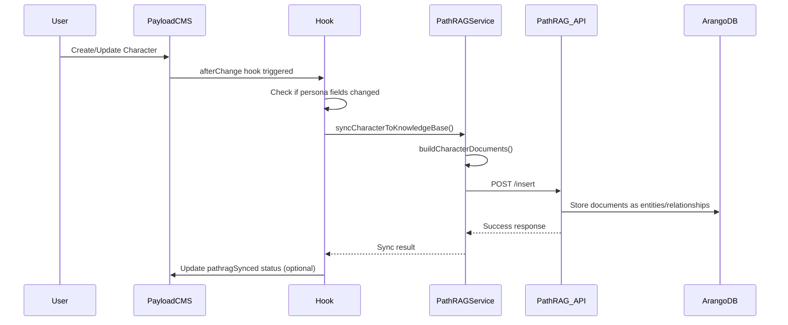
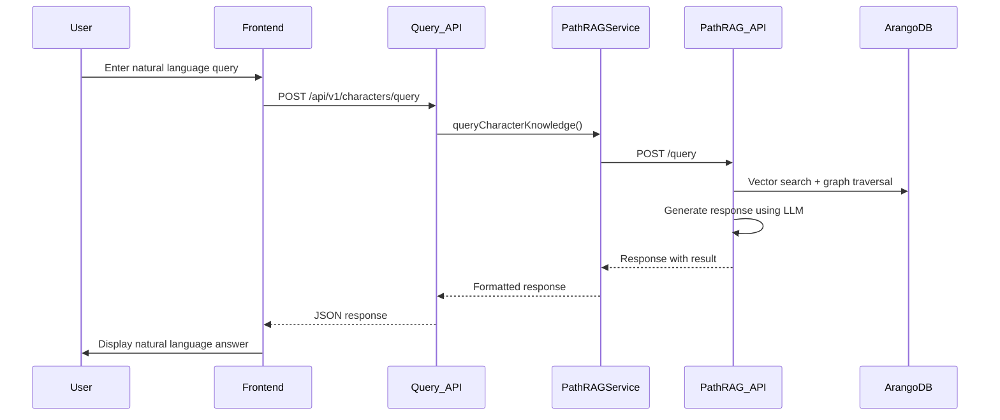

# PayloadCMS + PathRAG Integration Guide

## Overview

This document explains how PathRAG (Path Retrieval-Augmented Generation) is integrated with PayloadCMS collections in the Character Library app. PathRAG serves as a knowledge base that allows natural language querying of character data using advanced RAG techniques.

## Architecture Overview

```
┌─────────────────┐    ┌──────────────────┐    ┌─────────────────┐
│   PayloadCMS    │────│  PathRAG Service │────│  ArangoDB       │
│   Characters    │    │  (REST API)      │    │  Knowledge Base │
│   Collection    │    │                  │    │                 │
└─────────────────┘    └──────────────────┘    └─────────────────┘
         │                       │                        │
         │                       │                        │
    ┌────▼────┐             ┌────▼────┐              ┌────▼────┐
    │ Hooks & │             │ Query   │              │ Graph   │
    │ Auto    │             │ Engine  │              │ DB with │
    │ Sync    │             │         │              │ Vector  │
    └─────────┘             └─────────┘              │ Search  │
                                                     └─────────┘
```

## Integration Components

### 1. PathRAG Service (`src/services/PathRAGService.ts`)

The `PathRAGService` class provides the interface between PayloadCMS and the external PathRAG knowledge base service.

#### Key Methods:

```typescript
// Service initialization with environment variables
export class PathRAGService {
  private baseUrl: string
  private apiKey: string

  constructor() {
    this.baseUrl = process.env.PATHRAG_SERVICE_URL || 'http://localhost:5000'
    this.apiKey = process.env.PATHRAG_API_KEY || ''
  }

  // Health check for service availability
  async checkHealth(): Promise<{ healthy: boolean; details?: PathRAGHealthResponse; error?: string }>

  // Insert character documents into knowledge base
  async insertCharacterDocuments(documents: string | string[]): Promise<{
    success: boolean
    documentCount?: number
    error?: string
  }>

  // Query knowledge base with natural language
  async queryCharacterKnowledge(query: string, options: QueryOptions): Promise<{
    success: boolean
    result?: string
    query?: string
    error?: string
  }>

  // Delete entities from knowledge base
  async deleteEntity(entityName: string): Promise<{
    success: boolean
    relationshipsDeleted?: number
    error?: string
  }>

  // Get system statistics
  async getStats(): Promise<{
    success: boolean
    stats?: PathRAGStatsResponse
    error?: string
  }>
}
```

#### Document Building Process:

The service transforms PayloadCMS character data into PathRAG-compatible documents:

```typescript
private buildCharacterDocuments(character: any): string[] {
  const documents: string[] = []
  const characterName = character.name

  // Build comprehensive character profile
  const profileParts: string[] = []
  profileParts.push(`Character: ${characterName}`)
  
  // Add physical attributes
  if (character.age) profileParts.push(`Age: ${character.age}`)
  if (character.height) profileParts.push(`Height: ${character.height}`)
  if (character.eyeColor) profileParts.push(`Eye Color: ${character.eyeColor}`)
  
  // Add narrative content
  if (character.biography) {
    const bioText = this.extractTextFromField(character.biography)
    if (bioText) profileParts.push(`Biography: ${bioText}`)
  }

  if (character.personality) {
    const personalityText = this.extractTextFromField(character.personality)
    if (personalityText) profileParts.push(`Personality: ${personalityText}`)
  }

  // Add skills with levels
  if (character.skills && character.skills.length > 0) {
    const skillsText = character.skills
      .map((skill: any) => `${skill.skill} (${skill.level || 'unknown level'})${skill.description ? ': ' + skill.description : ''}`)
      .join(', ')
    profileParts.push(`Skills: ${skillsText}`)
  }

  // Combine into single document
  if (profileParts.length > 1) {
    documents.push(profileParts.join('. '))
  }

  return documents
}
```

### 2. Characters Collection Integration (`src/collections/Characters.ts`)

The Characters collection includes PathRAG-specific fields and hooks for automatic synchronization.

#### PathRAG-Specific Fields:

```typescript
{
  name: 'pathragSynced',
  type: 'checkbox',
  label: 'PathRAG Synced',
  admin: {
    readOnly: true,
    description: 'Indicates if character persona has been synced to PathRAG knowledge base.',
    position: 'sidebar',
  },
},
{
  name: 'pathragLastSync',
  type: 'date',
  label: 'PathRAG Last Sync',
  admin: {
    readOnly: true,
    description: 'Timestamp of the last successful PathRAG sync.',
    position: 'sidebar',
  },
},
{
  name: 'pathragDocumentCount',
  type: 'number',
  label: 'PathRAG Documents',
  admin: {
    readOnly: true,
    description: 'Number of documents synced to PathRAG knowledge base.',
    position: 'sidebar',
  },
}
```

#### Automatic Sync Hook:

```typescript
hooks: {
  afterChange: [
    async ({ doc, req: _req, operation, previousDoc }) => {
      try {
        // PathRAG sync for character persona data
        await syncCharacterToPathRAG(doc, operation, previousDoc)
      } catch (error) {
        console.error('Character hook error:', error)
      }
      return doc
    },
  ],
}

async function syncCharacterToPathRAG(doc: any, operation: string, previousDoc?: any) {
  // Only sync on create and update operations
  if (operation !== 'create' && operation !== 'update') {
    return
  }

  // Check if persona-related fields have changed
  const personaFields = [
    'name', 'biography', 'personality', 'motivations', 'relationships',
    'backstory', 'skills', 'role', 'archetype', 'psychology', 'characterArc',
    'physicalDescription', 'dialogueVoice', 'voiceModels', 'clothing',
    'age', 'height', 'weight', 'eyeColor', 'hairColor',
  ]

  let shouldSync = operation === 'create'

  // For updates, check if any persona fields changed
  if (operation === 'update' && previousDoc) {
    shouldSync = personaFields.some((field) => {
      const currentValue = JSON.stringify(doc[field])
      const previousValue = JSON.stringify(previousDoc[field])
      return currentValue !== previousValue
    })
  }

  if (shouldSync) {
    console.log(`Syncing character persona to PathRAG: ${doc.name}`)
    const syncResult = await pathragService.syncCharacterToKnowledgeBase(doc)
    
    if (syncResult.success) {
      console.log(`✓ Successfully synced ${doc.name} to PathRAG (${syncResult.documentsInserted} documents)`)
    } else {
      console.error(`✗ Failed to sync ${doc.name} to PathRAG:`, syncResult.error)
    }
  }
}
```

### 3. API Endpoints

#### PathRAG Management API (`src/app/api/v1/pathrag/manage/route.ts`)

Provides administrative functions for the PathRAG knowledge base:

```typescript
// POST /api/v1/pathrag/manage
interface ManagementRequest {
  action: 'sync_all' | 'sync_character' | 'delete_entity' | 'health_check' | 'get_stats'
  characterId?: string
  entityName?: string
  force?: boolean
}

// Example: Sync all characters
const response = await fetch('/api/v1/pathrag/manage', {
  method: 'POST',
  headers: { 'Content-Type': 'application/json' },
  body: JSON.stringify({
    action: 'sync_all',
    force: false // Set to true to resync already synced characters
  })
})

// Example: Sync specific character
const response = await fetch('/api/v1/pathrag/manage', {
  method: 'POST',
  headers: { 'Content-Type': 'application/json' },
  body: JSON.stringify({
    action: 'sync_character',
    characterId: 'character-id-here'
  })
})
```

#### Character Query API (`src/app/api/v1/characters/query/route.ts`)

Provides natural language querying capabilities:

```typescript
// POST /api/v1/characters/query
interface CharacterQueryRequest {
  query: string
  options?: {
    responseType?: 'Multiple Paragraphs' | 'Single Paragraph' | 'Bullet Points' | 'Detailed Explanation'
    topK?: number
    onlyContext?: boolean
    maxTokens?: {
      textUnit?: number
      globalContext?: number
      localContext?: number
    }
  }
}

// Example query
const response = await fetch('/api/v1/characters/query', {
  method: 'POST',
  headers: { 'Content-Type': 'application/json' },
  body: JSON.stringify({
    query: "Tell me about characters with magical abilities",
    options: {
      responseType: 'Multiple Paragraphs',
      topK: 40
    }
  })
})

const result = await response.json()
console.log(result.data.result) // Natural language response
```

### 4. Frontend Components

#### PathRAG Management Interface (`src/components/PathRAGManagementInterface.tsx`)

Administrative interface for managing the PathRAG knowledge base:

```typescript
export const PathRAGManagementInterface: React.FC = () => {
  const [loading, setLoading] = useState<string | null>(null)
  const [stats, setStats] = useState<PathRAGStats | null>(null)
  const [serviceHealth, setServiceHealth] = useState<boolean | null>(null)

  // Sync all characters
  const handleSyncAll = (force: boolean = false) => {
    const confirmMessage = force
      ? 'This will resync ALL characters to PathRAG, even if already synced. Continue?'
      : 'This will sync all unsynced characters to PathRAG. Continue?'

    if (window.confirm(confirmMessage)) {
      handleManagementAction('sync_all', { force })
    }
  }

  // Health check and stats display
  const fetchManagementInfo = async () => {
    const response = await fetch('/api/pathrag/manage')
    const data = await response.json()
    
    if (data.success) {
      setServiceHealth(data.data.serviceHealth.healthy)
      setStats(data.data.statistics)
    }
  }

  return (
    <div>
      {/* Service status display */}
      <div style={{ backgroundColor: serviceHealth ? '#d4edda' : '#f8d7da' }}>
        <strong>PathRAG Service:</strong> {serviceHealth ? '✓ Online' : '✗ Offline'}
        {stats && (
          <div>
            Documents: {stats.total_documents.toLocaleString()}<br/>
            Entities: {stats.total_entities.toLocaleString()}<br/>
            Relationships: {stats.total_relationships.toLocaleString()}
          </div>
        )}
      </div>
      
      {/* Management buttons */}
      <Button onClick={() => handleSyncAll(false)}>Sync All Characters</Button>
      <Button onClick={() => handleSyncAll(true)}>Force Resync All</Button>
    </div>
  )
}
```

#### Character Query Interface (`src/components/CharacterQueryInterface.tsx`)

User interface for natural language querying:

```typescript
export const CharacterQueryInterface: React.FC = () => {
  const [query, setQuery] = useState('')
  const [results, setResults] = useState<QueryResult[]>([])

  const handleQuery = async () => {
    const response = await fetch('/api/v1/characters/query', {
      method: 'POST',
      headers: { 'Content-Type': 'application/json' },
      body: JSON.stringify({
        query: query.trim(),
        options: {
          responseType: 'Multiple Paragraphs',
          topK: 40,
        },
      }),
    })

    const data = await response.json()
    if (data.success) {
      const newResult: QueryResult = {
        query: data.data.query,
        result: data.data.result,
        timestamp: data.data.timestamp,
      }
      setResults((prev) => [newResult, ...prev])
    }
  }

  return (
    <div>
      <textarea
        value={query}
        onChange={(e) => setQuery(e.target.value)}
        placeholder="Ask a question about your characters..."
      />
      <Button onClick={handleQuery}>Ask Question</Button>
      
      {/* Display results */}
      {results.map((result, index) => (
        <div key={index}>
          <strong>Q: {result.query}</strong>
          <p>{result.result}</p>
          <small>{new Date(result.timestamp).toLocaleString()}</small>
        </div>
      ))}
    </div>
  )
}
```

## Data Flow

### 1. Population and Updates



### 2. Querying Process



## Environment Configuration

Required environment variables for PathRAG integration:

```bash
# PathRAG Service Configuration
PATHRAG_SERVICE_URL=http://localhost:5000
PATHRAG_API_KEY=your-api-key-here  # Optional, depending on service setup

# PayloadCMS Database (for character data)
DATABASE_URI=mongodb://localhost:27017/character-library
PAYLOAD_SECRET=your-payload-secret
```

## Implementation in Other Apps

### 1. Basic Setup

To implement PathRAG in a similar PayloadCMS app:

1. **Install Dependencies**: Ensure your app has PayloadCMS and necessary dependencies
2. **Create PathRAG Service**: Copy and adapt `PathRAGService.ts` for your use case
3. **Configure Collection Hooks**: Add automatic sync hooks to relevant collections
4. **Set up API Routes**: Create management and query endpoints
5. **Add Frontend Components**: Implement query and management interfaces

### 2. Collection Adaptation

Adapt the character collection pattern for other content types:

```typescript
// Example: For a "Products" collection
export const Products: CollectionConfig = {
  slug: 'products',
  fields: [
    { name: 'name', type: 'text', required: true },
    { name: 'description', type: 'textarea' },
    { name: 'category', type: 'text' },
    { name: 'price', type: 'number' },
    { name: 'features', type: 'array', fields: [
      { name: 'feature', type: 'text' }
    ]},
    
    // PathRAG sync fields
    { name: 'pathragSynced', type: 'checkbox', admin: { readOnly: true } },
    { name: 'pathragLastSync', type: 'date', admin: { readOnly: true } },
    { name: 'pathragDocumentCount', type: 'number', admin: { readOnly: true } },
  ],
  hooks: {
    afterChange: [
      async ({ doc, operation, previousDoc }) => {
        await syncProductToPathRAG(doc, operation, previousDoc)
      }
    ]
  }
}

// Adapt document building for products
private buildProductDocuments(product: any): string[] {
  const documents: string[] = []
  const productName = product.name

  const productParts: string[] = []
  productParts.push(`Product: ${productName}`)
  
  if (product.description) productParts.push(`Description: ${product.description}`)
  if (product.category) productParts.push(`Category: ${product.category}`)
  if (product.price) productParts.push(`Price: $${product.price}`)
  
  if (product.features && product.features.length > 0) {
    const featuresText = product.features.map((f: any) => f.feature).join(', ')
    productParts.push(`Features: ${featuresText}`)
  }

  if (productParts.length > 1) {
    documents.push(productParts.join('. '))
  }

  return documents
}
```

### 3. Query Customization

Customize queries for your domain:

```typescript
// Domain-specific query examples
const exampleQueries = [
  'Find products under $100',
  'What electronics are in stock?',
  'Show me eco-friendly products',
  'Which products have wireless connectivity?',
  'Tell me about products in the gaming category',
]

// Custom query options for your domain
const queryOptions = {
  responseType: 'Product Recommendations',
  topK: 20, // Fewer results for product search
  onlyContext: false,
  maxTokens: {
    textUnit: 2000,
    globalContext: 2000,
    localContext: 3000,
  }
}
```

## Best Practices

### 1. Performance Optimization

- **Selective Syncing**: Only sync when relevant fields change
- **Batch Operations**: Use bulk sync for initial data population
- **Health Monitoring**: Regularly check PathRAG service health
- **Error Handling**: Implement robust error handling and retry logic

### 2. Data Quality

- **Field Validation**: Ensure text fields are properly formatted
- **Document Structure**: Create meaningful, searchable document structures
- **Consistent Formatting**: Maintain consistent data formats across documents

### 3. Security

- **API Key Management**: Securely store PathRAG API keys
- **Access Control**: Implement proper access controls for management endpoints
- **Input Validation**: Validate all user inputs before sending to PathRAG

### 4. Monitoring

- **Sync Status Tracking**: Monitor sync success/failure rates
- **Query Performance**: Track query response times and accuracy
- **Service Health**: Regular health checks and alerting

## Troubleshooting

### Common Issues

1. **Sync Failures**: Check PathRAG service health and network connectivity
2. **Empty Results**: Verify documents are properly formatted and synced
3. **Performance Issues**: Adjust query parameters (topK, maxTokens)
4. **Hook Loops**: Ensure hooks don't trigger infinite sync cycles

### Debug Tips

- Enable detailed logging in PathRAG service calls
- Use management interface to check sync status
- Verify document count matches expectations
- Test queries with simple examples first

This integration provides a powerful knowledge base system that makes character data easily searchable and queryable using natural language, while maintaining automatic synchronization with your PayloadCMS content.